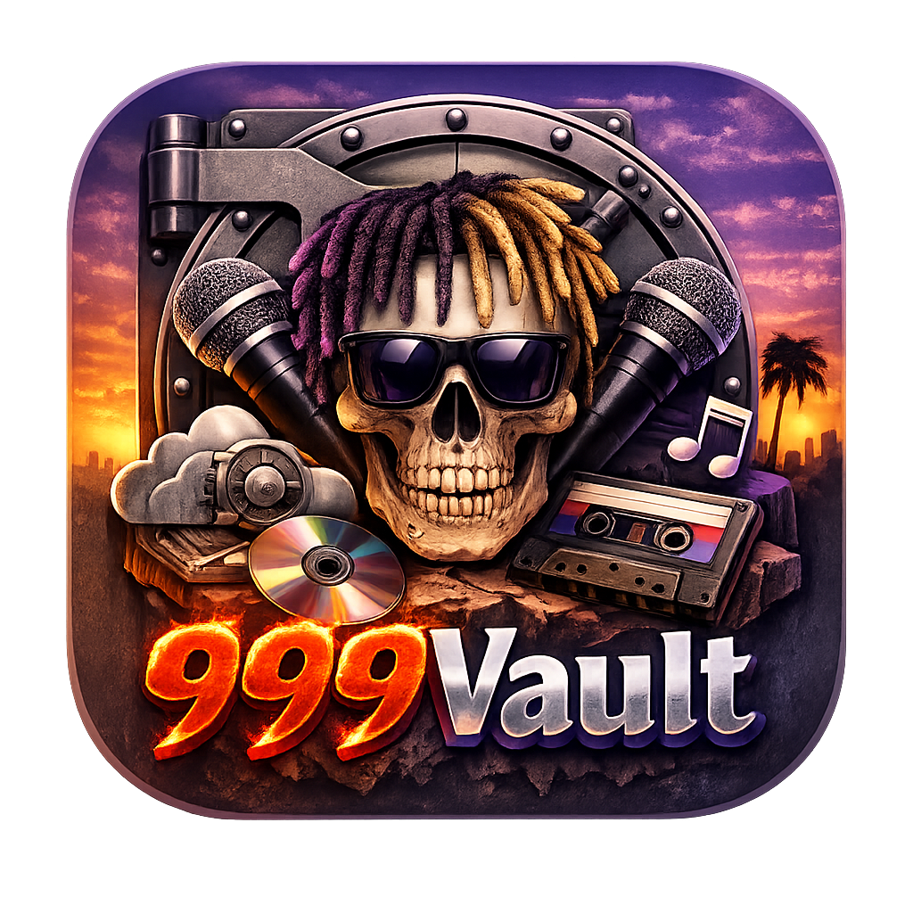

  

  

  <b>A desktop vault app for streaming unreleased Juice WRLD music.</b>

  
  

  
  
  

---

## The Vault Exists.

999Vault is a **cloud-streamed music vault** for unreleased and leaked Juice WRLD songs.

No installs.  
No uploads required.  
No waiting.

Just open the app — and the entire archive is there.

Stream instantly. Search instantly. Play instantly.

Everything lives in the cloud.  
Everything feels native.

---

## Preview

  

  

---

## Experience

999Vault was designed to feel like something that shouldn't exist.

Smooth. Silent. Immediate.

- Massive cover art display
- Instant streaming from Cloudflare R2
- Zero buffering playback
- Lightning-fast search
- Clean sidebar vault navigation
- Cinematic dark interface
- Native desktop performance

No loading screens. No friction.

---

## Streaming Architecture
